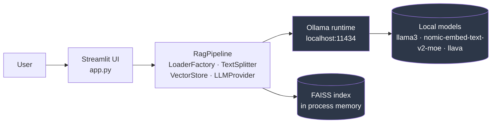
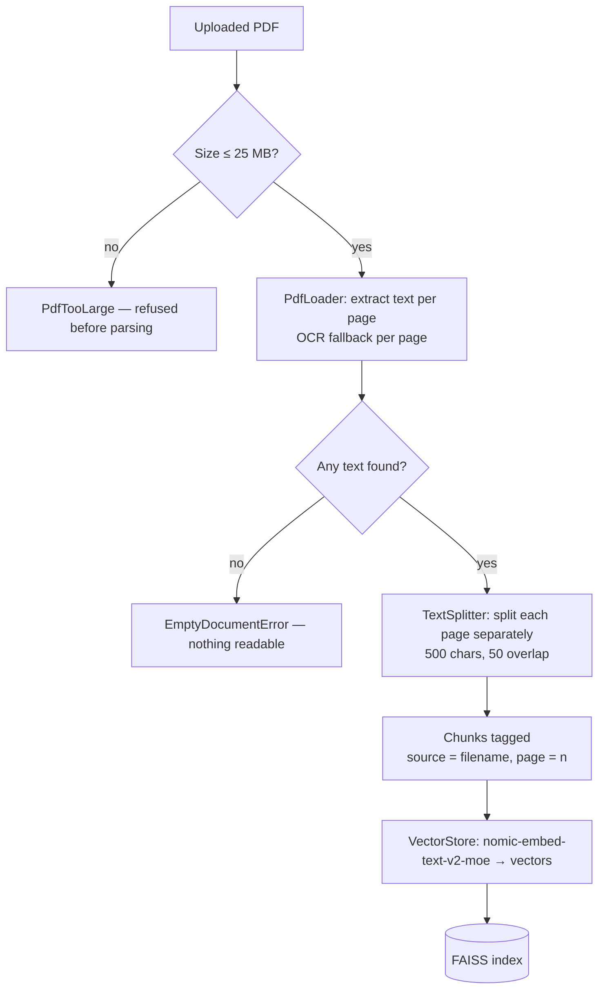
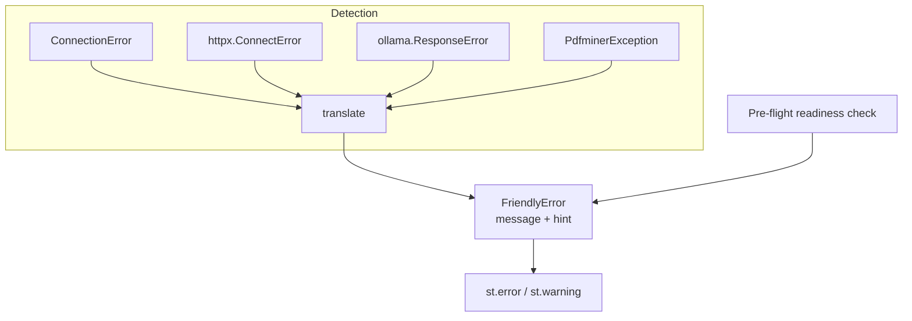
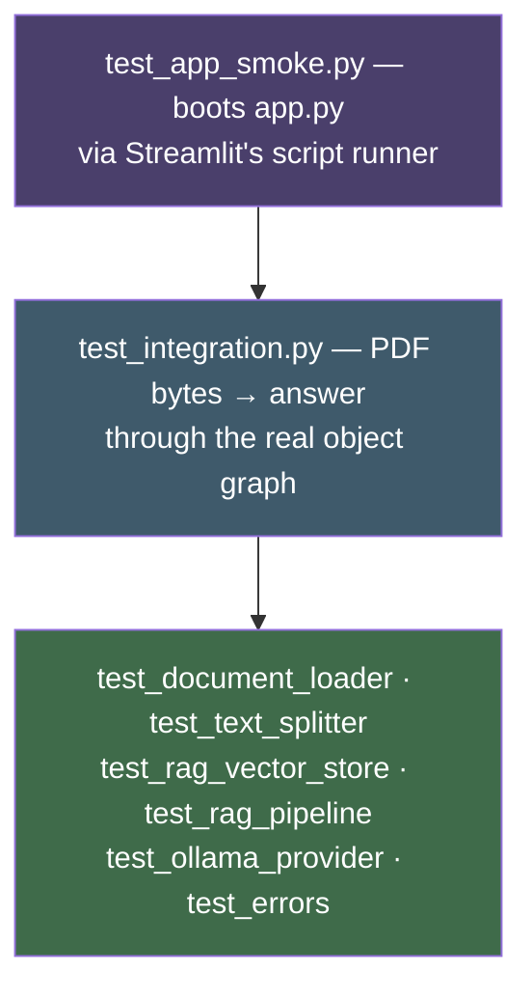
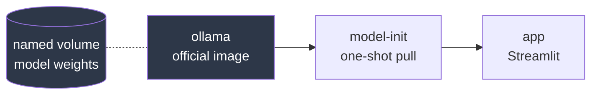

# Architecture

> Draft of the architecture/pipeline chapter of the thesis. It describes what
> the system is, how the parts fit together, and why the structure is what it
> is. The reasoning behind individual choices is recorded in
> [`DECISIONS.md`](../DECISIONS.md); this document describes the result.

---

## 1. System overview

DocuMind AI is a local document question-answering system. A user uploads one or
more PDFs and asks questions in natural language; the system answers from the
content of those documents and cites the file and page each part of the answer
came from.

The defining constraint is that **no document content leaves the machine**.
Every stage — text extraction, embedding, vector search, and answer generation —
runs locally. The system makes no network request that carries user data, and
requires no API key.



Three things are worth noticing in that diagram:

1. **The vector index lives in process memory**, not on disk. It is built when a
   document is uploaded and discarded when the session ends.
2. **Ollama is a separate process**, reached over HTTP on localhost. The
   application never loads model weights itself.
3. **There is no database.** The only persistent state in the system is the
   model weights that Ollama manages.

---

## 2. Component structure

The codebase is organised by pipeline stage rather than by technical layer. Each
class owns one step and can be tested in isolation.

| Module | Responsibility | Depends on |
|---|---|---|
| `app.py` | Streamlit UI only: widgets, session state, error rendering. It builds the objects below once at startup and calls methods on them | `documind/`, `errors.py` |
| `documind/documents/` | `DocumentLoader` — the one way a file becomes a `Document`; `PdfLoader` (per-page text, OCR fallback) and `TextLoader` (`.txt`/`.md`) implement it; `LoaderFactory` picks between them by extension; `TextSplitter` cuts a `Document` into page-tagged `Chunk`s | pdfplumber, `ocr.py`, LangChain splitter |
| `documind/rag/` | `VectorStore` — `Chunk`s in, the matching `Chunk`s back out; the FAISS index, the embedding model and the metadata keys all stay inside it. `RagPipeline` — the upload and question paths end to end, built from a `LoaderFactory`, a `TextSplitter`, a `VectorStore` and an `LLMProvider`; it also writes the cited prompt and the Sources list | langchain-ollama, FAISS |
| `documind/llm/` | `LLMProvider` — what the app asks of a model; `OllamaProvider` — the chat, vision and document-answer calls to Ollama | langchain-ollama, ollama, Pillow |
| `documind/chat/` | `ChatSession` — the conversation, the only object that can change it, and its text export | — |
| `documind/config.py` | `AppConfig` — every tunable setting in one frozen object, handed to whoever needs it | — |
| `ocr.py` | Optional Tesseract fallback: detect a page with no text layer, render it, read it | pytesseract, Pillow |
| `errors.py` | Failure translation and pre-flight readiness checks | ollama, httpx |
| `config.py` | UI vocabulary only: mode names and avatars | — |

The dependency graph is acyclic and shallow: `app.py` depends on the pipeline
classes, the pipeline classes depend only on libraries, and nothing depends on
`app.py`. That is what makes the pipeline testable without Streamlit, and what
lets the test suite exercise the whole chain without a UI.

Since the OOP refactor the UI file contains no pipeline knowledge at all: an
upload is `RagPipeline.ingest(file)` and a question is `RagPipeline.ask(question)`,
and `grep -nE "pdfplumber|ollama|faiss|langchain" app.py` returns nothing. The
four modules that used to hold the procedural pipeline — `pdf_handler.py`,
`vector_store.py`, `rag_chain.py`, `llm_chain.py` — and the `chat_history.py`
list no longer exist; each was deleted once the class replacing it covered its
callers.

---

## 3. The RAG pipeline

RAG — Retrieval Augmented Generation — addresses a specific problem: a language
model has no knowledge of a document it was never trained on. Rather than
fine-tuning a model per document, RAG retrieves the passages relevant to a
question and places them in the prompt, so the model reasons over supplied text
instead of recalled text. The answer is *grounded* in the document.

### 3.1 Ingestion



The whole column is one call — `RagPipeline.ingest(file)` — which returns an
`IngestReport`: the document's name, its page count, how many chunks were
indexed, how many pages needed OCR, and how long it took. The UI reports those
numbers and knows nothing about the steps that produced them.

Two properties of this stage carry the rest of the system:

**Page-wise splitting.** The text splitter is applied to each page
independently, never to the concatenated document. A chunk assembled across a
page boundary would have no single honest page number, and any citation attached
to it would be a guess. Splitting page by page guarantees each chunk belongs to
exactly one page. The cost is a few short chunks at page ends. A test,
`test_no_chunk_spans_two_pages`, pins this invariant.

**Metadata as a first-class payload.** Each chunk is a `Chunk` carrying its
source filename and page number as typed fields. `VectorStore` flattens those
into the `{"source": ..., "page": ...}` dictionary FAISS stores, builds the index
with `FAISS.from_documents` rather than `from_texts`, and rebuilds a `Chunk` from
the dictionary on the way back out. That round trip is the single change that
makes citation possible — and because it happens in one class, no other file in
the project ever writes those two metadata keys.

### 3.2 Retrieval

A question is embedded with the same model used for the chunks — this matters,
because similarity is only meaningful within one embedding space — and FAISS
returns the `k` nearest chunks by vector distance.

All documents share **one** index. Uploading a second PDF adds its chunks to the
existing index rather than creating a parallel one, so "which document best
answers this question?" is decided by embedding distance rather than by a
hand-written merge rule across separate indexes.

`k` is 4 for a single document and 6 once several are loaded. The widening is a
deliberate mitigation: with a fixed small `k`, one long document can plausibly
occupy every slot and crowd out a shorter file that holds the actual answer.

### 3.3 Generation

Retrieved chunks are rendered into a numbered context block:

```
[1] handbook.pdf, p. 3
the submission deadline is March first

---

[2] finance.pdf, p. 2
the budget forecast for the quarter
```

The prompt instructs the model to answer only from this context, to cite the
`[n]` markers inline, to say "I couldn't find that information in the document"
when the answer is absent, and never to cite a number not listed. Its last line
before `ANSWER:` names the language to answer in: Macedonian when most of the
question's letters are Cyrillic, English otherwise. The not-found sentence
switches with it (DECISIONS.md #21). The answer
streams token by token to the UI, and the same numbered passages are rendered
beneath it in a Sources panel.

The numbering is what closes the loop. The model cites `[2]`; the reader expands
Sources and sees that `[2]` is page 2 of `finance.pdf`, together with the text
the model was actually given. A grounded answer the reader cannot verify is
still just a claim; this makes it checkable.

---

## 4. Error handling architecture

A local-first system has more ways to be misconfigured than a hosted one: the
runtime may not be started, a model may not be downloaded. These are the normal
first-run experience, not exotic edge cases, so they are treated as a designed
part of the system rather than as exceptions to be caught somewhere.



The design has three parts:

1. **One translation point.** `errors.translate` is the only place that knows
   what an `httpx.ConnectError` means. Every call site does the same two things:
   catch, and render. Four different code paths — chat streaming, vision
   streaming, PDF indexing, PDF answering — therefore produce identical wording
   for identical causes.
2. **Every message carries a remedy.** A `FriendlyError` has a `message` (what
   went wrong) and a `hint` (what to do, usually a command to copy). A test
   asserts that every error type defines a hint.
3. **Pre-flight, not only reactive.** Both tabs render a readiness panel that
   verifies Ollama is reachable and the required models are installed *before*
   anything is uploaded. Catching a failure when the user asks their first
   question is correct but late; they have already uploaded a file and waited
   through indexing.

One implementation detail proved instructive and is worth reporting in the
thesis: `ollama.list()` wraps connection failures in a plain Python
`ConnectionError`, but a *streaming* `ollama.chat()` connects lazily during
iteration and surfaces the raw `httpx.ConnectError`. Two exception types, one
cause. This was found by probing the real client with the server stopped, not by
reading documentation — a small illustration of why integration boundaries need
empirical testing rather than assumption.

---

## 5. Testing strategy

The suite has 227 tests and runs with **no Ollama server and no model pulled**.
That constraint drove several design choices and is the reason the tests are
usable in CI rather than being a demo script.



| Layer | What it proves | Substitutions |
|---|---|---|
| Unit | Extraction, chunking, metadata, retrieval, prompt shape, error mapping | Fake embeddings |
| Integration | The whole chain from PDF bytes to a cited answer | Fake embeddings, stubbed Ollama |
| Smoke | `app.py` actually starts and renders, with Ollama up and down | Stubbed `ollama.list` |

Three techniques make this possible:

**Injectable embeddings.** `VectorStore(config, embeddings=None)` defaults to
`OllamaEmbeddings` but accepts any `Embeddings` implementation. The tests pass a
deterministic bag-of-words fake. Because it is a real `Embeddings` subclass,
FAISS indexing and similarity search are genuinely executed — only the model
behind them is substituted.

**A substitutable model.** `RagPipeline` is handed an `LLMProvider`, not an
Ollama client, so a test can pass a `FakeProvider` that implements the same four
methods and replays canned tokens. The pipeline cannot tell the difference, which
is what lets the ingest-to-citation path be exercised with no server anywhere —
and is the clearest demonstration in the codebase of why the abstraction exists.

**Generated test PDFs.** `tests/conftest.py` contains a small raw PDF writer
that builds a valid PDF from a list of page strings. A test asserting "this
chunk is on page 3" is only readable if page 3's content is visible in the test
itself; a committed binary fixture hides that, and adding `reportlab` would be a
heavyweight dependency for one job.

What the suite deliberately does **not** test is answer quality. That is a
research-evaluation question requiring labelled question–answer pairs, and it is
outside the scope of an engineering-focused capstone. Section 7 revisits this as
future work.

---

## 6. Deployment

Two supported paths, with different trade-offs.

**Local Python install** — a virtualenv, `pip install -r requirements.txt`, and
a locally installed Ollama. Lowest overhead for development; requires the
correct Python version and a working Ollama on the host.

**Docker Compose** — three services:



Model weights live in a named volume, so the roughly 6 GB download happens once
and survives `docker compose down`. The `model-init` service exists to solve an
ordering problem: having `app` wait for Ollama to be merely *reachable* is not
enough, because the first question would then fail with "model not found".
Instead `app` waits on `service_completed_successfully` of the pull step, so by
the time the UI is available, the models are genuinely present.

The app finds the runtime through the `OLLAMA_HOST` environment variable, which
both the `ollama` client and `langchain-ollama` honour — verified empirically
before the compose file was written.

---

## 7. Known limitations and future work

Stated plainly, because a limitation named in the thesis is a stronger position
than one found by the committee.

| Limitation | Consequence | Possible resolution |
|---|---|---|
| OCR needs a native binary | Scanned PDFs are unreadable unless Tesseract is installed (the Docker image bundles it) | Ship the container, or document the install |
| FAISS has no cheap delete | Removing a file from the uploader does not un-index it; only a full clear does | Rebuild the index on removal, or move to a store with deletion |
| Index is not persisted | Re-indexing on every session, 10–30 s per document | `FAISS.save_local`, if the use case shifts to a fixed corpus |
| No answer-quality evaluation | Retrieval and grounding are untested for accuracy | A small labelled question set with retrieval precision@k |
| Fixed chunk size (500/50) | Not tuned against this corpus | Sweep chunk size and overlap, measure retrieval precision |
| `langchain-community` FAISS import | Upstream has announced it is sunsetting the package | Migrate when a standalone integration package exists |
| Single-user, session-scoped | Not designed for concurrent users | Out of scope; the local-first premise assumes one user |

The most academically valuable of these is the fourth. The system currently
demonstrates that grounding and citation *work mechanically* — the right page is
retrieved and correctly attributed, which the tests verify. It does not
demonstrate how *often* the right page is retrieved. A modest labelled set of
questions over a known document, scored by whether the correct page appears in
the top `k`, would turn a qualitative claim into a measured one, and is the
natural next step for the evaluation chapter.
